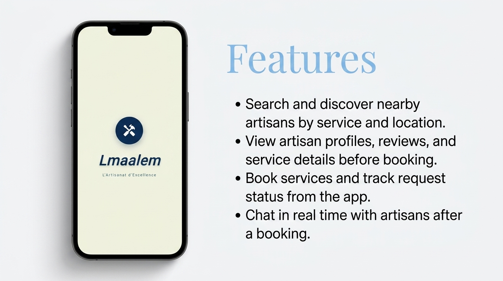
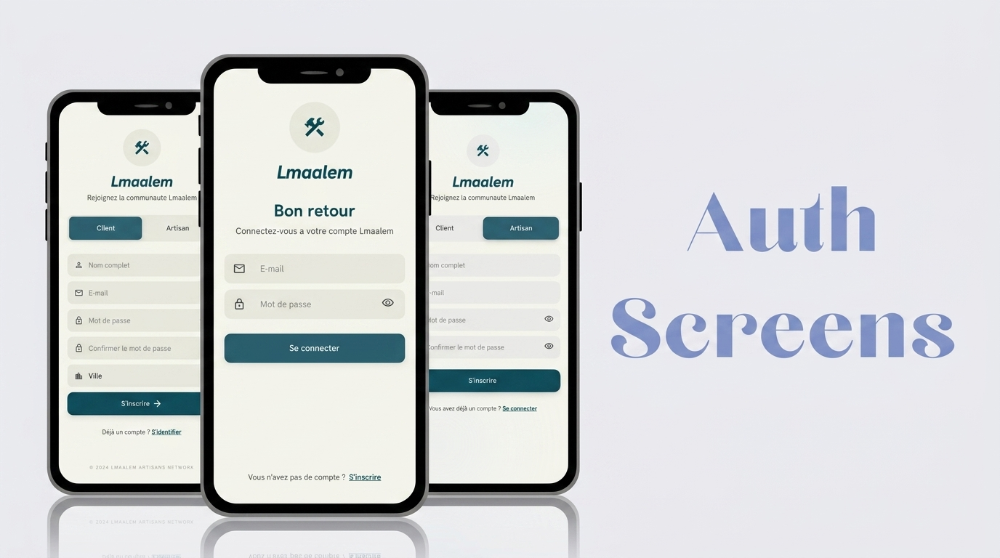
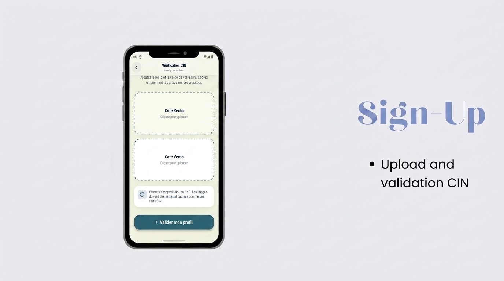
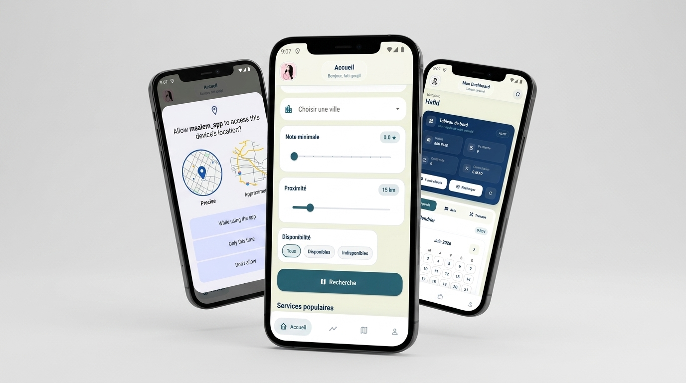
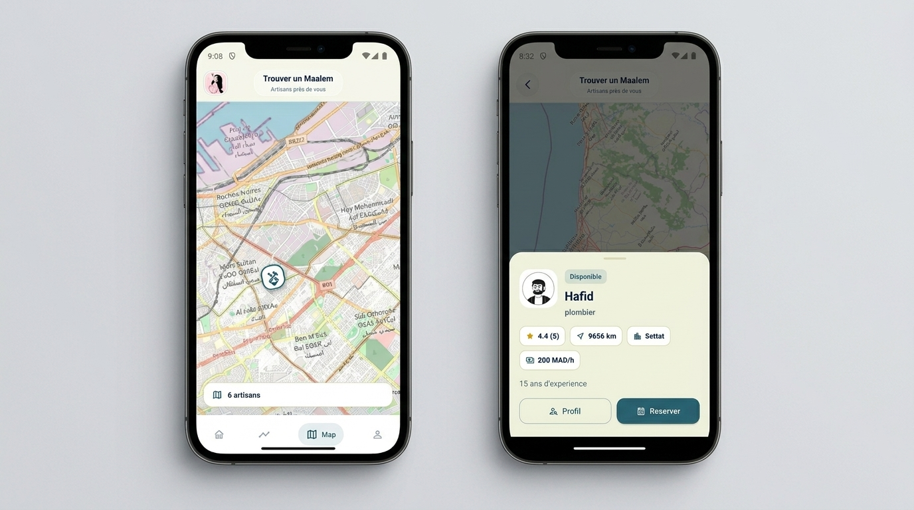
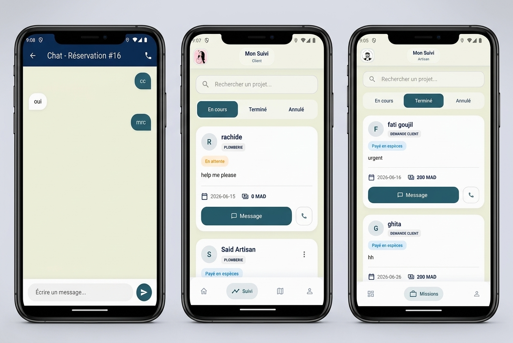
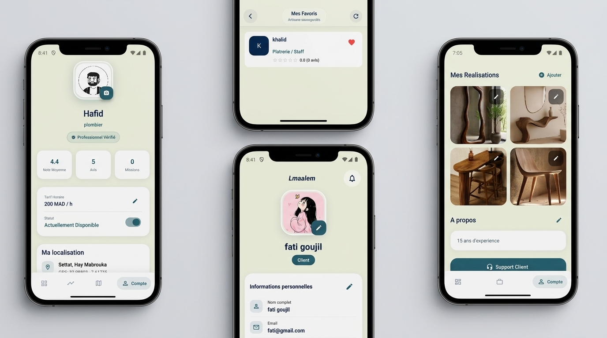

<div align="center">

# Lmaalem

### A mobile marketplace that connects clients with trusted local artisans.

<p>
  <a href="#features"></a>
  <a href="#tech-stack"></a>
  <a href="#tech-stack"></a>
  <a href="#tech-stack"></a>
</p>

<p>
  <strong>Lmaalem</strong> helps clients discover nearby artisans, book services, track requests, chat in real time, and manage trusted profiles from a clean mobile experience.
</p>

</div>

---

## Overview

Lmaalem is a full-stack mobile application designed to make local artisan services easier to find, compare, book, and manage. The platform supports two main user experiences:

- Clients can create an account, search for artisans, view profiles, save favorites, request services, track bookings, and chat with artisans.
- Artisans can register, complete their professional profile, manage incoming requests, follow bookings, and communicate with clients.

The project includes a Flutter mobile app, an Express.js backend API, PostgreSQL persistence, file uploads, JWT authentication, rate limiting, and real-time messaging powered by Socket.IO.

---

## Screenshots

<p align="center">
  
</p>

<p align="center">
  
</p>

<p align="center">
  
</p>

<p align="center">
  
</p>

<p align="center">
  
</p>

<p align="center">
  
</p>

<p align="center">
  
</p>

---

## Features

- Role-based onboarding for clients and artisans.
- JWT authentication with protected API endpoints.
- Artisan discovery with search, profile details, and location-aware browsing.
- Interactive map support using Flutter Map and geolocation.
- Booking management and request tracking for both clients and artisans.
- Real-time chat between clients and artisans using Socket.IO.
- Favorite artisans list for faster future access.
- CIN/file upload flow with backend upload handling.
- Reviews and complaints backend modules.
- Dockerized backend and PostgreSQL database setup.

---

## Tech Stack

| Layer | Technologies |
| --- | --- |
| Mobile app | Flutter, Dart, Provider, HTTP, Shared Preferences |
| Maps and location | flutter_map, latlong2, geolocator |
| Real-time messaging | Socket.IO, socket_io_client |
| Backend | Node.js, Express.js |
| Database | PostgreSQL |
| Auth and security | JWT, bcryptjs, express-rate-limit, express-validator |
| Uploads | Multer |
| DevOps | Docker, Docker Compose |

---

## Project Structure

```text
Lmaalem-project/
+-- db/
|   +-- init.sql
+-- maalem_app/
|   +-- lib/
|   |   +-- core/
|   |   +-- data/
|   |   +-- presentation/
|   |   +-- providers/
|   |   +-- shared/
|   +-- pubspec.yaml
+-- maalem_server/
|   +-- src/
|   |   +-- controllers/
|   |   +-- middleware/
|   |   +-- models/
|   |   +-- routes/
|   |   +-- app.js
|   +-- Dockerfile
|   +-- package.json
+-- screenshots/
+-- uploads/
+-- docker-compose.yml
+-- README.md
```

---

## Getting Started

### Prerequisites

Make sure you have the following installed:

- Flutter SDK 3.x
- Dart SDK
- Node.js 18+
- npm
- Docker and Docker Compose

### Environment Variables

Create a `.env` file in the project root:

```env
DB_HOST=localhost
DB_PORT=5432
DB_NAME=your_database_name
DB_USER=your_database_user
DB_PASSWORD=your_database_password
PORT=8081
JWT_SECRET=your_long_random_jwt_secret
```

When running with Docker Compose, the backend uses the `maalem-db` service as its database host internally.

---

## Run with Docker

From the project root:

```bash
docker compose up --build
```

The backend API will be available at:

```text
http://localhost:8081
```

The PostgreSQL database will be exposed on:

```text
localhost:5432
```

---

## Run the Backend Locally

```bash
cd maalem_server
npm install
npm run dev
```

The server starts on:

```text
http://localhost:8081
```

---

## Run the Flutter App

```bash
cd maalem_app
flutter pub get
flutter run
```

If you run the app on an Android emulator, make sure the API base URL points to your host machine correctly, commonly:

```text
http://10.0.2.2:8081
```

For a physical device, use your machine's local network IP address.

---

## API Modules

The backend exposes modules for:

- Authentication
- Artisan search and profile management
- Bookings
- Messages
- Reviews
- Complaints
- Uploads

Main API entry points include:

```text
/auth
/api/bookings
/api/messages
/api/reviews
/api/complaints
/api
/uploads
```

---

## Roadmap

- Improve artisan verification workflow.
- Add push notifications for bookings and messages.
- Add automated tests for API modules and Flutter flows.
- Prepare production deployment configuration.

---

## Author

Built by [Goujil-F0](https://github.com/Goujil-F0).

---

## License

No license has been specified yet.
